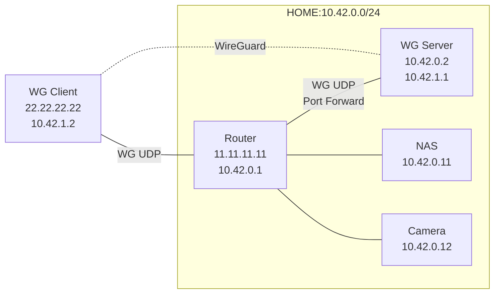
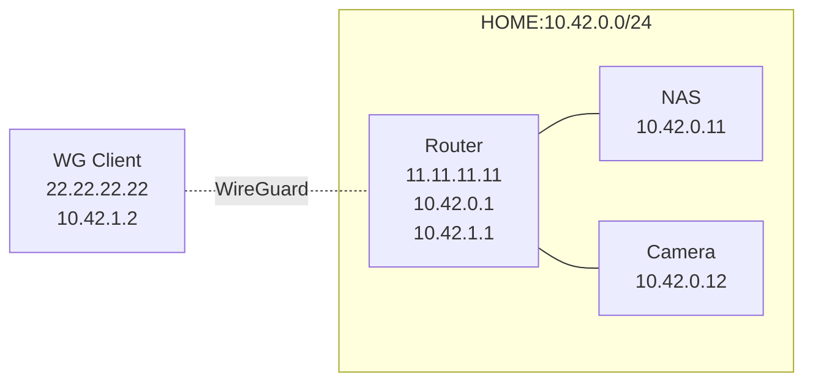

在家里搭建了NAS、PT等服务后，在外面访问家里的资源成为一个迫在眉睫的需求，而 VPN 本来就是设计为实现这个需求的软件。经过痛苦的数小时 Cisco IPSec 配置并且部署失败后，最终选择了 [WireGuard](https://www.wireguard.com/) 作为 VPN 方案。

WireGuard 协议中所有节点均为对等节点 Peer，不存在服务端和客户端的概念。但是我们可以人为划分节点角色，不同角色使用不同的配置也可以实现C/S模式。


## 架构设计

家里已经有一个物理网络`10.42.0.0/24`，网关为路由器`10.42.0.1`，有几种可行方案：
1. 路由器`10.42.0.1`提供了 OpenVPN 服务端，但其版本未知，存在极大安全风险。
2. 单独搭建 VPN 服务端，配置 ARP 转发到路由器`10.42.0.1`，由路由器提供网关身份。[Jimmy Xu](https://jimmyxu.org/) 强烈不建议这么做，ARP 转发很麻烦。

~~最终采用以下方案：~~
* ~~单独搭建 VPN 服务端，使用独立的虚拟网络 `10.42.1.0/24`；~~
* ~~路由器对 VPN 服务端口做端口转发，将 VPN 服务端暴露到互联网；~~
* ~~VPN 服务端同时具备物理网络身份 `10.42.0.2`；~~
* ~~VPN 服务端和路由器（物理网络网关）相互做静态路由。~~



*(Update 2019-05-15)* 由于购置了 OpenWRT 路由器，路由器`10.42.0.1`可以提供 WireGuard VPN 服务了，所以改用架构更为简洁的第一种方案。
* 在路由器上搭建 VPN 服务端，使用独立的网络 `10.42.1.0/24`；
* 在路由器的 WAN 口放开互联网对 VPN 服务端口的访问；
* 路由器同时作为两个网络 `10.42.0.0/24` 和  `10.42.1.0/24` 的网关。



-           | VPN Server       | VPN Client
----------- | ---------------- | -------------
External IP | `11.11.11.11`    | `22.22.22.22`
Internal IP | `10.42.1.1/24`   | `10.42.1.2/24`
WG Port     | `12450`          | -


## 基础环境

* Arch Linux: 5.0.7-1-ARCH
* WireGuard: 0.0.20190406


## 生成密钥

生成私钥
```
$ wg genkey > prikey
$ chmod 600 prikey
```

生成公钥
```
$ wg pubkey < prikey > pubkey
```

一行搞定
```
$ wg genkey | tee prikey | wg pubkey | tee pubkey
## 输出为 pubkey
```


## WireGuard 配置

服务端
```
[Interface]
Address = 10.42.1.1/24
ListenPort = 12450
PrivateKey = [ServerPriKey]

# Required when iptables chain FORWARD's policy is not ACCEPT.
#PostUp = iptables -A FORWARD -i %i -j ACCEPT
#PostDown = iptables -D FORWARD -i %i -j ACCEPT

[Peer]
AllowedIPs = 10.42.1.2/24
PublicKey = [ClientPubKey]
PersistentKeepalive = 30
```

客户端
```
[Interface]
Address = 10.42.1.2/24                      # 客户端虚拟地址
PrivateKey = [ClientPriKey]

[Peer]
PublicKey = [ServerPubKey]
AllowedIPs = 10.42.0.0/24, 10.42.1.0/24     # 只有内部网络走VPN
Endpoint = 11.11.11.11:12450
PersistentKeepalive = 30
```

## ~~网关配置~~

~~物理网关需要配置静态路由到 VPN网关；VPN 服务端为物理网络成员，无需配置路由。~~

```
$ ip route add 10.42.1.0/24 via 10.42.0.2
```